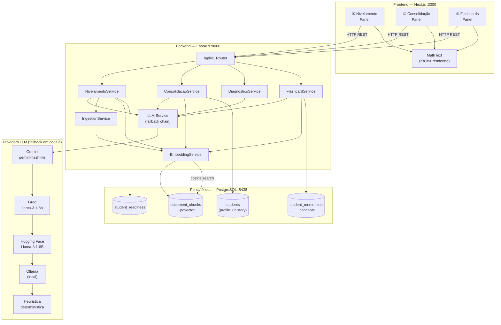
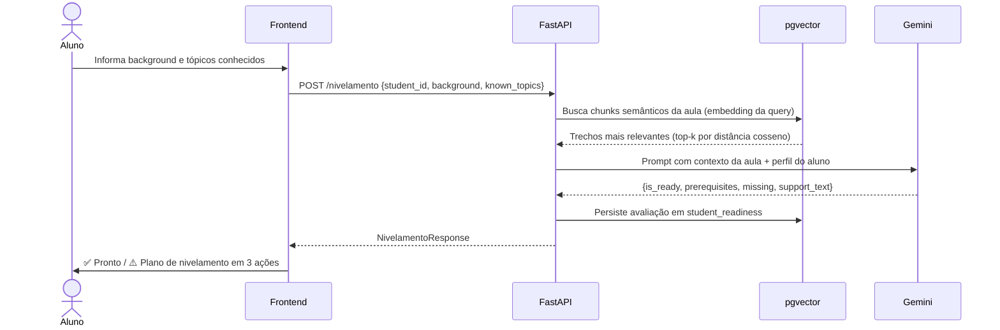
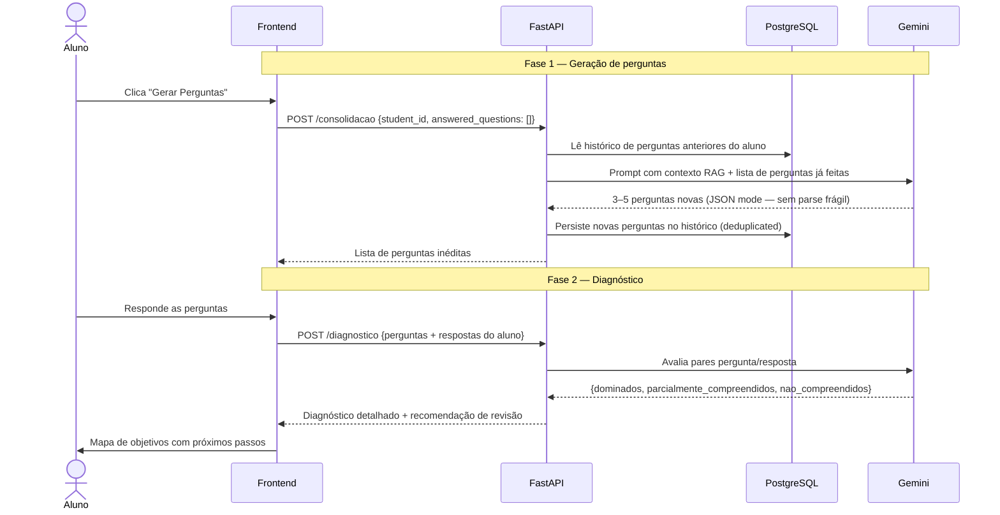
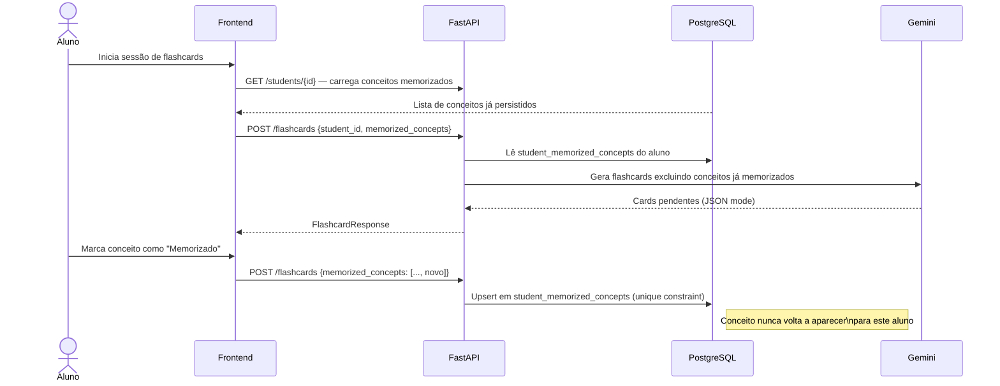
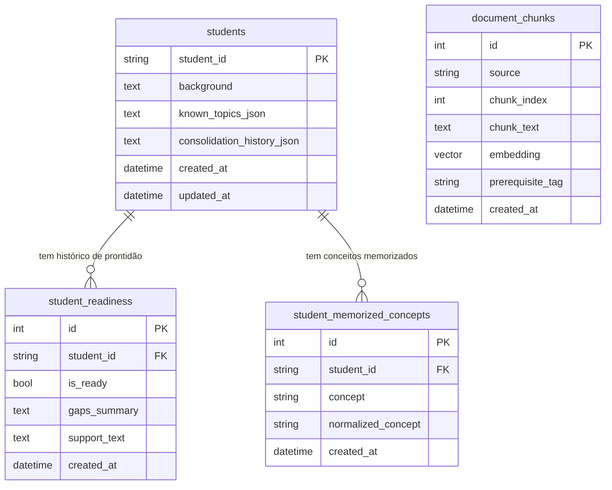

# Agente de Nivelamento — Cálculo I

> **Sistema de tutoria adaptativa com IA** que acompanha o aluno antes, durante e depois de uma aula de Cálculo I — entendendo lacunas de conhecimento, avaliando compreensão real e reforçando memória de longo prazo de forma personalizada e contínua.

---

## O problema

Plataformas de ensino expõem o mesmo conteúdo para todos os alunos, independentemente do que cada um já sabe ou não sabe. O resultado: alunos sem base suficiente se perdem na aula; alunos avançados se desmotivam com revisão desnecessária. E depois da aula, sem acompanhamento, o conhecimento não consolida.

**Este sistema resolve as três etapas críticas da jornada de aprendizagem:**

```
Antes da aula          Durante/após a aula       Reforço contínuo
─────────────────      ───────────────────────   ─────────────────
Identificar lacunas →  Verificar compreensão  →  Memorizar o essencial
Case 1: Nivelamento    Case 2: Consolidação       Case 3: Flashcards
```

---

## Arquitetura do sistema



---

## Como o sistema funciona (fluxo por case)

### Case 1 — Nivelamento pré-aula

O agente analisa o perfil do aluno contra os pré-requisitos reais da aula (extraídos via RAG + LLM), identifica lacunas e gera um plano de estudo personalizado de 3 ações.



**O que vai além do básico:**
- Pré-requisitos extraídos dinamicamente da aula real via RAG — não hardcoded
- Quando há lacunas, gera conteúdo explicativo personalizado (não apenas lista o que está faltando)
- Histórico de prontidão persistido: é possível acompanhar a evolução do aluno ao longo do tempo

---

### Case 2 — Consolidação pós-aula

O agente gera perguntas inéditas a cada sessão (nunca repete), avalia as respostas e classifica os objetivos de conhecimento em três níveis: dominado, parcial e não compreendido.



**O que vai além do básico:**
- Histórico de perguntas por aluno persistido no banco — nunca repete questões entre sessões
- Diagnóstico em 3 níveis de proficiência com recomendação personalizada
- JSON mode do Gemini elimina parse frágil de respostas semi-estruturadas

---

### Case 3 — Flashcards com memória adaptativa

O sistema gera flashcards apenas para conceitos ainda não dominados pelo aluno. Conceitos marcados como memorizados são persistidos e excluídos automaticamente das próximas sessões.



**O que vai além do básico:**
- Persistência em tabela dedicada (`student_memorized_concepts`) com `UniqueConstraint` — sem risco de duplicatas
- Sessão adaptativa: cada nova interação parte do ponto exato onde o aluno parou
- Perfil do aluno pré-carregado automaticamente ao digitar o `student_id` — zero atrito na retomada

---

## Modelo de dados



---

## Diferenciais técnicos

| # | Decisão | Por que importa |
|---|---|---|
| 1 | **LLM com fallback em cadeia** (Gemini → Groq → HuggingFace → Ollama → heurística) | Sistema nunca retorna 500; degrada graciosamente mesmo sem acesso a APIs externas |
| 2 | **Gemini JSON mode** (`responseMimeType: "application/json"`) | Elimina regex hacks e parse frágil; output estruturado garantido pelo modelo |
| 3 | **RAG com pgvector + gemini-embedding-2 (1536 dims MRL)** | Pré-requisitos extraídos do conteúdo real da aula — não inventados pelo LLM |
| 4 | **Histórico de perguntas por aluno** (deduplicated, persisted) | Consolidação genuinamente progressiva — não repete questões entre sessões |
| 5 | **Tabela dedicada para conceitos memorizados** (unique constraint) | Queries eficientes, sem risco de duplicata, permite remoção individual |
| 6 | **Auto-preload do perfil do aluno** (`GET /students/{id}` ao digitar o ID) | UX que retoma onde parou — sem reentrada de dados a cada sessão |
| 7 | **KaTeX no frontend** (componente `MathText`) | Fórmulas como $\lim_{x \to a} f(x)$ renderizadas corretamente — não expostas como LaTeX cru |
| 8 | **Fluxo pedagógico sequencial (stepper)** | Comunica a progressão correta pré-aula → pós-aula → memorização sem bloquear acesso livre |

---

## Tech stack

| Camada | Tecnologia |
|---|---|
| Frontend | Next.js 15, React 19, TypeScript, Tailwind CSS v4, KaTeX v0.17 |
| Backend | FastAPI, Python 3.12, SQLAlchemy (psycopg3), Alembic |
| Banco de dados | PostgreSQL 18 + extensão pgvector |
| Embeddings / RAG | `gemini-embedding-2` via Google Gemini (1536 dims, MRL-truncated) |
| LLM primário | Google Gemini `gemini-flash-lite-latest` (JSON mode para outputs estruturados) |
| LLM fallback | Groq → Hugging Face Inference API → Ollama local → heurística determinística |
| Infra | Docker Compose, Adminer |

---

## Rodando o projeto

### Pré-requisitos

- Docker e Docker Compose
- Chave de API do Google Gemini — gratuita em [aistudio.google.com/apikey](https://aistudio.google.com/apikey)

### 1. Configurar variáveis de ambiente

```bash
cp backend/.env.example backend/.env
```

Edite `backend/.env`:

```env
GEMINI_API_TOKEN=AIzaSy...
GEMINI_CHAT_MODEL=gemini-flash-lite-latest
GEMINI_EMBEDDING_MODEL=gemini-embedding-2

# Fallbacks opcionais:
GROQ_API_TOKEN=gsk_...
HUGGINGFACE_API_TOKEN=hf_...
```

### 2. Subir o backend e banco

```bash
docker compose up -d
```

Serviços:
- `db` — PostgreSQL em `localhost:5438`
- `backend` — FastAPI em `localhost:8000`
- `adminer` — Admin do banco em `localhost:8080`

### 3. Indexar a aula no banco de vetores

Necessário apenas uma vez (ou ao atualizar `calculo_i_aula.md`):

```bash
curl -X POST http://localhost:8000/api/v1/nivelamento/ingest
# {"status":"ok","chunks_indexed":18,"source":"calculo_i_aula.md"}
```

### 4. Rodar o frontend

```bash
cd frontend
pnpm install
pnpm dev
```

Acesse em **http://localhost:3000**

### Verificação rápida

```bash
curl http://localhost:8000/api/v1/health
# {"status":"ok"}
```

### Admin do banco (Adminer)

Acesse **http://localhost:8080** com:
- Sistema: `PostgreSQL` | Servidor: `db` | Usuário: `postgres` | Senha: `postgres` | Base: `agente_nivelamento`

---

## Demonstração guiada

Use este perfil para testar todos os casos em sequência:

| Campo | Valor |
|---|---|
| **ID do aluno** | `demo_aluno_01` |
| **Background** | `Tenho base em funções e álgebra, mas nunca estudei derivadas nem limites formalmente.` |
| **Tópicos conhecidos** | `Funções, Álgebra, Trigonometria básica` |

**Case 1:** O agente identifica Limites e Derivadas como lacunas e gera um plano em 3 ações. Adicione `Limites, Derivadas` aos tópicos e rode novamente — o agente confirma prontidão total.

**Case 2:** Gere perguntas, responda de forma incompleta e veja a classificação de objetivos. Rode novamente com o mesmo aluno — as perguntas serão diferentes.

**Case 3:** Gere flashcards, marque um conceito como memorizado e gere novamente — ele não aparece mais. Troque para `demo_aluno_02` — o sistema começa do zero.

---

## Endpoints da API

| Método | Rota | Descrição |
|---|---|---|
| `GET` | `/api/v1/health` | Health check |
| `POST` | `/api/v1/nivelamento/ingest` | Indexa a aula no pgvector |
| `POST` | `/api/v1/nivelamento` | Avalia prontidão do aluno (Case 1) |
| `POST` | `/api/v1/consolidacao` | Gera perguntas de consolidação (Case 2 — fase 1) |
| `POST` | `/api/v1/diagnostico` | Diagnóstico de objetivos por respostas (Case 2 — fase 2) |
| `POST` | `/api/v1/flashcards` | Gera e filtra flashcards por aluno (Case 3) |
| `GET` | `/api/v1/students/{id}` | Retorna perfil completo do aluno |

Documentação interativa: **http://localhost:8000/docs**

---

## Estrutura do projeto

```
agente-nivelamento-calculo/
├── backend/
│   ├── app/
│   │   ├── api/routes.py              # Roteamento FastAPI
│   │   ├── services/                  # Lógica de negócio (um arquivo por case)
│   │   │   ├── nivelamento_service.py
│   │   │   ├── consolidacao_service.py
│   │   │   ├── diagnostico_service.py
│   │   │   ├── flashcard_service.py
│   │   │   ├── llm_service.py         # Fallback chain de LLM
│   │   │   ├── embedding_service.py   # Gemini embeddings + pgvector
│   │   │   └── ingestion.py           # Pipeline de ingestão RAG
│   │   ├── prompts/                   # Templates de prompt por case
│   │   ├── db/models.py               # ORM SQLAlchemy
│   │   └── core/config.py             # Settings via .env (pydantic-settings)
│   ├── alembic/versions/              # Migrações versionadas
│   └── data/calculo_i_aula.md         # Base de conhecimento
├── frontend/
│   └── app/
│       ├── page.tsx                   # Orquestração de estado global
│       ├── types.ts                   # Tipos TypeScript alinhados com a API
│       └── components/
│           ├── NivelamentoPanel.tsx
│           ├── ConsolidacaoPanel.tsx
│           ├── FlashcardsPanel.tsx
│           └── MathText.tsx           # Renderização KaTeX de fórmulas
├── docs/
│   ├── architecture.md                # Arquitetura detalhada
│   ├── decisions.md                   # Registro de decisões técnicas (ADR)
│   └── api-examples.md                # Exemplos curl para todos os endpoints
└── docker-compose.yml
```

