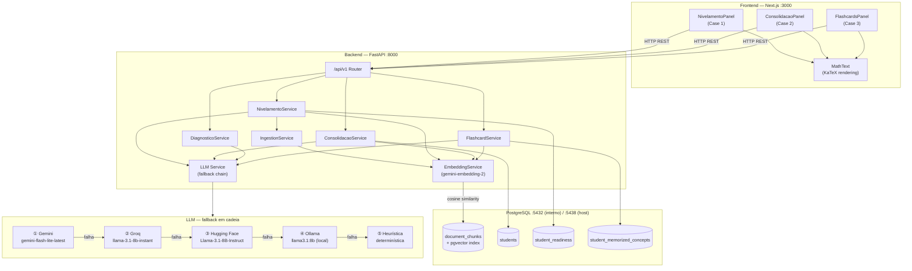
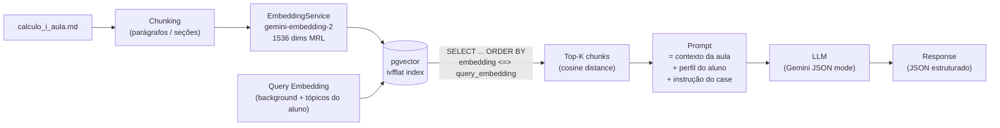
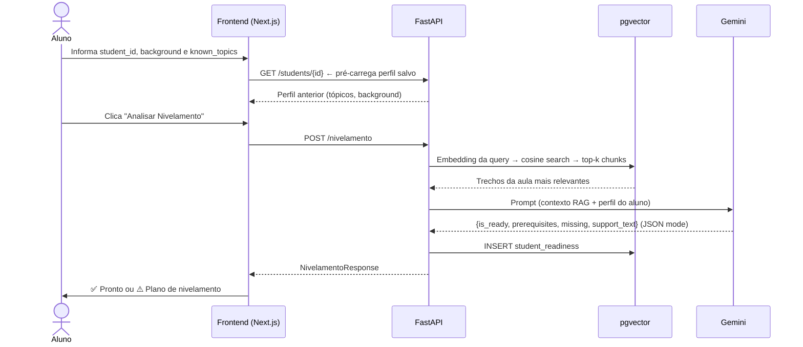
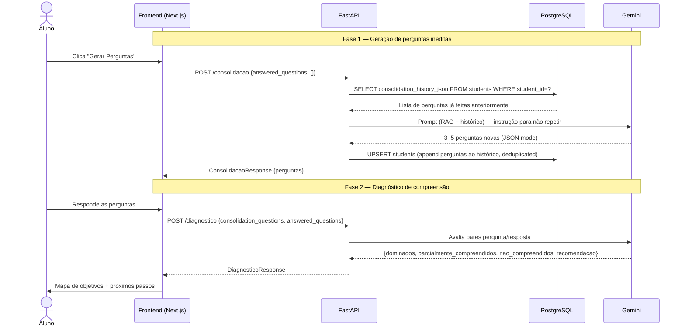
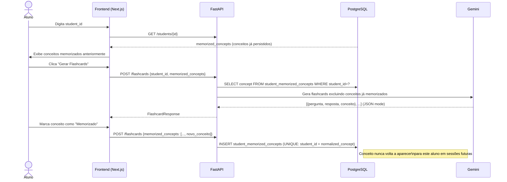
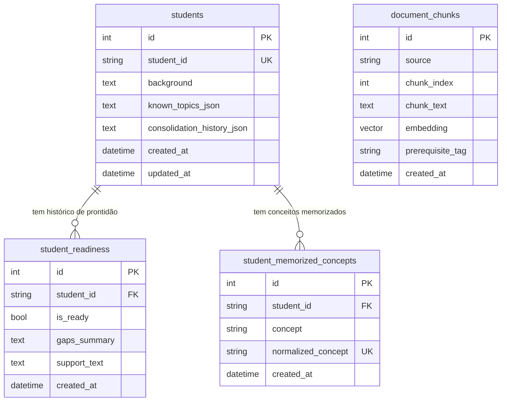

# Arquitetura — Agente de Nivelamento Cálculo I

## Visão geral

O sistema é composto por três camadas principais: um frontend Next.js, uma API FastAPI com serviços especializados por case, e um banco PostgreSQL com a extensão pgvector para busca semântica.



---

## Pipeline RAG (Retrieval-Augmented Generation)

Toda resposta do LLM é ancorada em trechos reais da aula. Isso elimina alucinação de pré-requisitos e garante que as perguntas de consolidação e os flashcards sejam baseados no conteúdo que o aluno de fato estudou.



### Parâmetros de ingestão

| Parâmetro | Valor |
|---|---|
| Modelo de embedding | `gemini-embedding-2` |
| Dimensionalidade | 1536 (MRL-truncated) |
| Índice pgvector | `ivfflat` (cosine) |
| Rota de ingestão | `POST /api/v1/nivelamento/ingest` |
| Chunks indexados | ~18 (aula atual) |

---

## Cadeia de fallback do LLM

O `LLM_PROVIDER` no `.env` define o provider primário. Se a chamada falhar por qualquer motivo (rate limit, timeout, ausência de chave), o `LLMService` tenta automaticamente o próximo na cadeia:

```
① Gemini  (gemini-flash-lite-latest)   ← padrão; suporta JSON mode nativo
  └─▶ ② Groq  (llama-3.1-8b-instant)
        └─▶ ③ Hugging Face (Llama-3.1-8B-Instruct via Inference API)
              └─▶ ④ Ollama local (llama3.1:8b)
                    └─▶ ⑤ Heurística determinística (sem LLM — nunca retorna 500)
```

Para endpoints que produzem JSON estruturado (flashcards, consolidação, extração de pré-requisitos), o Gemini recebe `responseMimeType: "application/json"` na `generationConfig`. Isso elimina a necessidade de regex de extração e parse tolerante a falhas.

---

## Fluxo de requisição — Case 1 (Nivelamento)



---

## Fluxo de requisição — Case 2 (Consolidação + Diagnóstico)



---

## Fluxo de requisição — Case 3 (Flashcards)



---

## Modelo de dados



### Responsabilidade de cada tabela

| Tabela | Case | Propósito |
|---|---|---|
| `document_chunks` | RAG (todos) | Chunks da aula de Cálculo I com embeddings vetoriais (pgvector) |
| `student_readiness` | Case 1 | Histórico de avaliações de prontidão por aluno |
| `students` | Case 2 | Perfil do aluno: background, tópicos, histórico de perguntas de consolidação |
| `student_memorized_concepts` | Case 3 | Conceitos já memorizados por aluno — tabela separada para queries eficientes |

---

## Persistência de perfil do aluno

```
POST /nivelamento  ──▶  student_readiness (histórico de prontidão)
POST /consolidacao ──▶  students.consolidation_history_json (deduplica perguntas por sessão)
POST /flashcards   ──▶  student_memorized_concepts (UPSERT com unique constraint)
GET  /students/:id ──▶  perfil completo → pré-preenchimento automático no frontend
```

O frontend detecta automaticamente o perfil salvo ao digitar o `student_id` e pré-preenche tópicos conhecidos, background e conceitos memorizados. Um banner indica ao aluno o que foi carregado do histórico.

---

## Renderização de fórmulas matemáticas

O frontend usa KaTeX para renderizar expressões LaTeX presentes nas respostas do LLM. O componente `MathText` faz o parse do texto, identifica delimitadores `$...$` (inline) e `$$...$$` (display mode) e delega cada segmento ao KaTeX antes de renderizar o HTML.

Exemplos de fórmulas renderizadas:

- Limite: $\lim_{x \to a} \frac{f(x) - f(a)}{x - a}$
- Derivada pela regra da cadeia: $\frac{d}{dx}[f(g(x))] = f'(g(x)) \cdot g'(x)$
- Regra do produto: $(fg)' = f'g + fg'$

