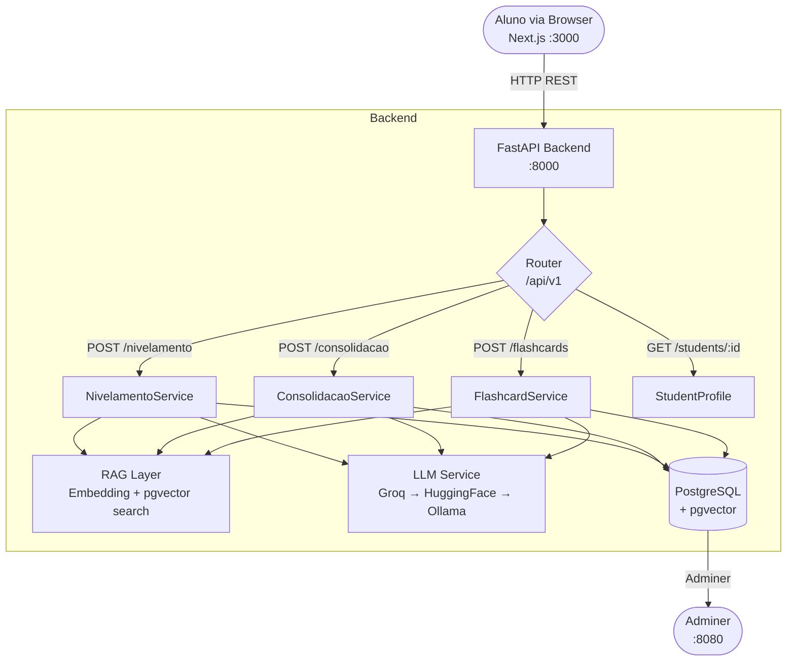
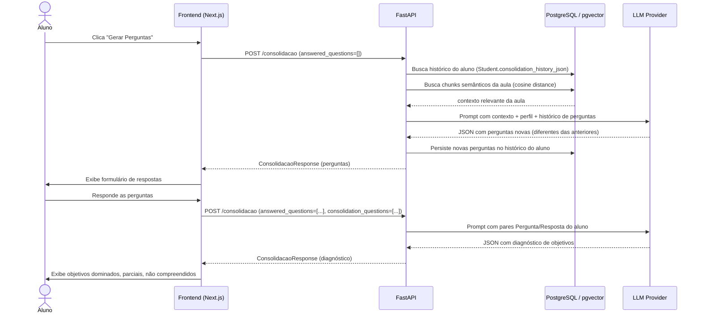

# Arquitetura — Agente de Nivelamento Cálculo I

## Visão geral



## Fluxo de uma requisição (exemplo: Consolidação)



## Componentes de banco de dados

| Tabela | Propósito |
|---|---|
| `document_chunks` | Chunks da aula de Cálculo I com embeddings vetoriais (pgvector) |
| `student_readiness` | Histórico de avaliações de prontidão por aluno (Case 1) |
| `students` | Perfil do aluno: background, tópicos conhecidos, histórico de perguntas de consolidação |
| `student_memorized_concepts` | Conceitos já memorizados por aluno (Case 3) |

## Cadeia de fallback do LLM

```
Gemini (gemini-flash-lite-latest)        ← provider padrão
  └─▶ Groq (llama-3.1-8b-instant)
        └─▶ Hugging Face Inference API (meta-llama/Llama-3.1-8B-Instruct)
              └─▶ Ollama local (llama3.1:8b)
                    └─▶ Fallback determinístico (heurística local, sem LLM)
```

O provider ativo é configurado via `LLM_PROVIDER` no `.env`. Para endpoints que retornam JSON estruturado (flashcards, consolidação, extração de pré-requisitos), o Gemini recebe `responseMimeType: "application/json"` na `generationConfig`, eliminando a necessidade de parse tolerante a falhas.

## RAG — Retrieval-Augmented Generation

1. A aula `calculo_i_aula.md` é segmentada em chunks e indexada no pgvector via `POST /nivelamento/ingest`
2. Os embeddings são gerados por `gemini-embedding-2` (Google) com dimensão 1536 via MRL-truncation
3. Cada requisição gera um embedding da query do aluno (background + tópicos conhecidos)
4. Os `top_k` chunks mais próximos por distância cosseno alimentam o prompt do LLM como contexto
5. O LLM responde com base somente no conteúdo real da aula — sem alucinação de pré-requisitos inventados

## Persistência de perfil do aluno

```
POST /nivelamento  ──▶  student_readiness (histórico de prontidão)
POST /consolidacao ──▶  students.consolidation_history_json (deduplica perguntas)
POST /flashcards   ──▶  student_memorized_concepts (conceitos marcados)
GET  /students/:id ──▶  retorna perfil completo para pré-carregamento no frontend
```

O frontend detecta automaticamente o perfil salvo ao digitar o `student_id` e pré-preenche tópicos conhecidos, background e conceitos memorizados — informando ao aluno o que está sendo aproveitado do histórico.

## Renderização de fórmulas matemáticas

O frontend usa KaTeX para renderizar expressões LaTeX presentes nas respostas do LLM (`$...$` inline, `$$...$$` display mode). O componente `MathText` faz o parse do texto e delega cada segmento ao KaTeX antes de renderizar em HTML.
